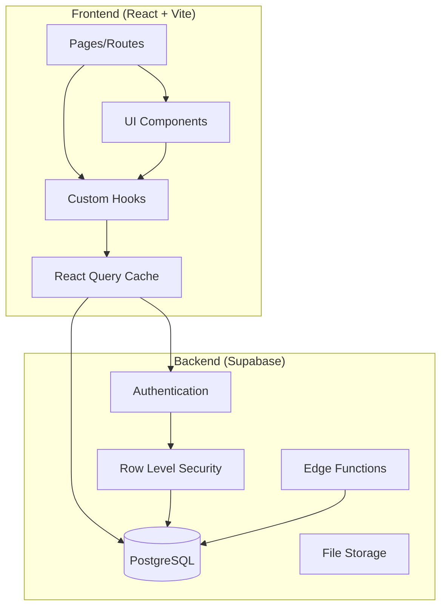
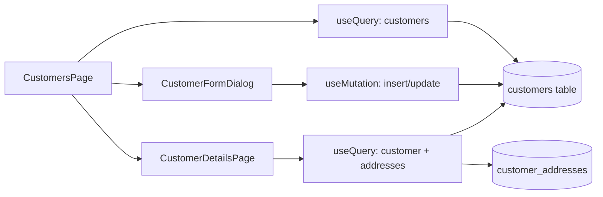
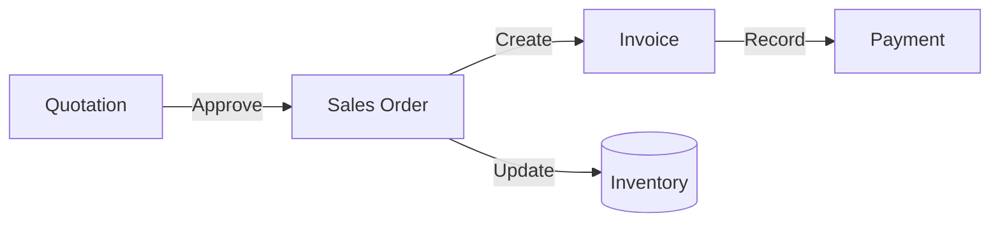
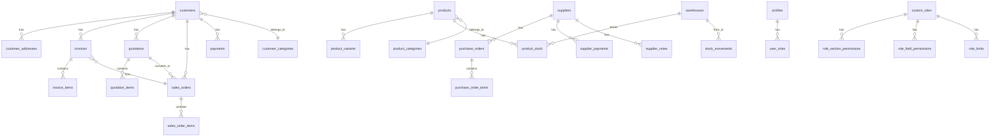
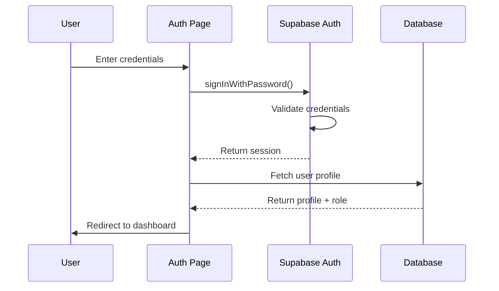
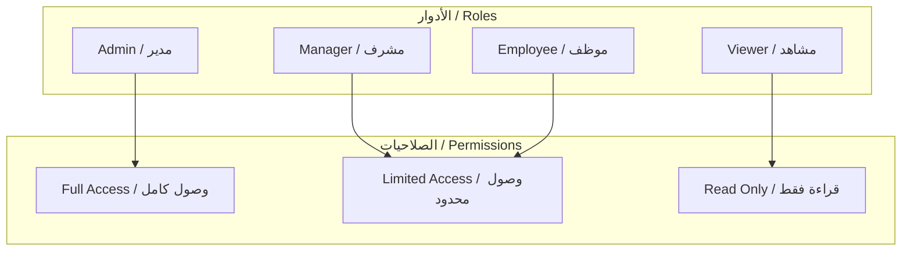
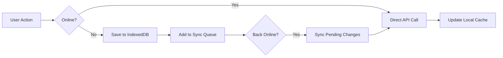

# 📚 Project Documentation / توثيق المشروع
# ERP System - Comprehensive Documentation

> **Last Updated / آخر تحديث**: 2025-01-13
> **Version / الإصدار**: 1.0.0
> **Status / الحالة**: Production Ready ✅

---

## 📋 Table of Contents / جدول المحتويات

1. [Project Overview / نظرة عامة](#-project-overview--نظرة-عامة)
2. [Technology Stack / التقنيات المستخدمة](#-technology-stack--التقنيات-المستخدمة)
3. [Project Architecture / هيكل المشروع](#-project-architecture--هيكل-المشروع)
4. [Pages / الصفحات](#-pages--الصفحات)
5. [Components / المكونات](#-components--المكونات)
6. [Hooks / الخطافات](#-hooks--الخطافات)
7. [Utilities / المساعدات](#-utilities--المساعدات)
8. [Database Schema / هيكل قاعدة البيانات](#-database-schema--هيكل-قاعدة-البيانات)
9. [Security / الأمان](#-security--الأمان)
10. [Features / الميزات](#-features--الميزات)
11. [Testing / الاختبارات](#-testing--الاختبارات)
12. [API Reference / مرجع API]

---

## 🎯 Project Overview / نظرة عامة

### English
A comprehensive Enterprise Resource Planning (ERP) system built with modern web technologies. The system provides complete business management capabilities including:
- Customer Relationship Management (CRM)
- Inventory Management
- Sales & Purchasing
- Financial Management (Invoices, Payments)
- Reporting & Analytics
- User Management & Permissions

### العربية
نظام تخطيط موارد المؤسسات (ERP) شامل مبني بتقنيات الويب الحديثة. يوفر النظام إمكانيات إدارة الأعمال الكاملة بما في ذلك:
- إدارة علاقات العملاء (CRM)
- إدارة المخزون
- المبيعات والمشتريات
- الإدارة المالية (الفواتير، المدفوعات)
- التقارير والتحليلات
- إدارة المستخدمين والصلاحيات

---

## 🛠 Technology Stack / التقنيات المستخدمة

### Frontend / الواجهة الأمامية

| Technology | Version | Purpose / الغرض |
|------------|---------|-----------------|
| React | 18.3.1 | UI Framework / إطار واجهة المستخدم |
| TypeScript | 5.x | Type Safety / أمان الأنواع |
| Vite | 5.x | Build Tool / أداة البناء |
| Tailwind CSS | 3.x | Styling / التنسيق |
| shadcn/ui | Latest | UI Components / مكونات الواجهة |
| React Router | 6.30.1 | Routing / التوجيه |
| React Query | 5.83.0 | Data Fetching / جلب البيانات |
| React Hook Form | 7.61.1 | Form Management / إدارة النماذج |
| Zod | 3.25.76 | Validation / التحقق |

### Backend / الخلفية

| Technology | Purpose / الغرض |
|------------|-----------------|
| Supabase | Database & Auth / قاعدة البيانات والمصادقة |
| PostgreSQL | Database Engine / محرك قاعدة البيانات |
| Row Level Security | Data Protection / حماية البيانات |
| Edge Functions | Serverless Functions / الوظائف السحابية |

### Additional Libraries / مكتبات إضافية

| Library | Purpose / الغرض |
|---------|-----------------|
| Recharts | Charts & Graphs / الرسوم البيانية |
| jsPDF | PDF Generation / إنشاء PDF |
| date-fns | Date Utilities / أدوات التاريخ |
| Lucide React | Icons / الأيقونات |
| Framer Motion | Animations / الحركات |
| @dnd-kit | Drag & Drop / السحب والإفلات |

---

## 🏗 Project Architecture / هيكل المشروع

### Directory Structure / هيكل المجلدات

```
📁 src/
├── 📁 components/           # Reusable UI components
│   ├── 📁 ui/              # shadcn/ui base components (50+)
│   ├── 📁 layout/          # Layout components (7)
│   ├── 📁 mobile/          # Mobile-specific components (12)
│   ├── 📁 customers/       # Customer module components
│   ├── 📁 products/        # Product module components
│   ├── 📁 invoices/        # Invoice module components
│   ├── 📁 suppliers/       # Supplier module components
│   ├── 📁 quotations/      # Quotation module components
│   ├── 📁 sales-orders/    # Sales order components
│   ├── 📁 purchase-orders/ # Purchase order components
│   ├── 📁 inventory/       # Inventory components
│   ├── 📁 payments/        # Payment components
│   ├── 📁 employees/       # Employee components
│   ├── 📁 categories/      # Category components
│   ├── 📁 reports/         # Report components
│   ├── 📁 settings/        # Settings components
│   ├── 📁 print/           # Print templates (5)
│   ├── 📁 export/          # Export components
│   ├── 📁 filters/         # Filter components
│   ├── 📁 navigation/      # Navigation components
│   ├── 📁 notifications/   # Notification components
│   ├── 📁 offline/         # Offline support components
│   ├── 📁 sidebar/         # Sidebar components
│   ├── 📁 shared/          # Shared components
│   ├── 📁 table/           # Table customization
│   ├── 📁 search/          # Search components
│   ├── 📁 customization/   # UI customization
│   └── 📁 dashboard/       # Dashboard widgets
│
├── 📁 pages/               # Route pages (27 pages)
│   ├── 📁 admin/           # Admin pages (10)
│   ├── 📁 customers/       # Customer pages (2)
│   ├── 📁 products/        # Product pages (2)
│   ├── 📁 invoices/        # Invoice pages (2)
│   ├── 📁 suppliers/       # Supplier pages (3)
│   ├── 📁 quotations/      # Quotation pages (2)
│   ├── 📁 sales-orders/    # Sales order pages (2)
│   ├── 📁 purchase-orders/ # Purchase order pages (2)
│   ├── 📁 employees/       # Employee pages (2)
│   └── ...                 # Other pages
│
├── 📁 hooks/               # Custom React hooks (22)
├── 📁 lib/                 # Utility functions (10)
├── 📁 integrations/        # External integrations
│   └── 📁 supabase/        # Supabase client & types
├── 📁 __tests__/           # Test files
│   ├── 📁 unit/            # Unit tests
│   ├── 📁 integration/     # Integration tests
│   └── 📁 security/        # Security tests
└── 📁 test/                # Test utilities & mocks

📁 supabase/
├── 📁 functions/           # Edge functions
└── 📁 migrations/          # Database migrations

📁 e2e/                     # End-to-end tests (Playwright)

📁 docs/                    # Documentation
├── PROJECT_DOCUMENTATION.md
└── PROJECT_PROGRESS.md
```

### Architecture Diagram / مخطط الهيكل



---

## 📄 Pages / الصفحات

### Overview / نظرة عامة

Total Pages: **27 pages** across **11 modules**

### Module: Dashboard / لوحة التحكم

#### `Dashboard.tsx`
| Property | Value |
|----------|-------|
| **Route** | `/` |
| **Purpose** | Main dashboard with widgets and statistics |
| **الغرض** | لوحة التحكم الرئيسية مع الويدجت والإحصائيات |
| **Components Used** | `WidgetContainer`, `DraggableWidget`, charts |
| **Data Sources** | Multiple tables aggregation |
| **Features** | Drag & drop widgets, customizable layout |

```tsx
// Example usage / مثال الاستخدام
import Dashboard from '@/pages/Dashboard';

// In router
<Route path="/" element={<Dashboard />} />
```

---

### Module: Customers / العملاء

#### `CustomersPage.tsx`
| Property | Value |
|----------|-------|
| **Route** | `/customers` |
| **Purpose** | List all customers with search and filters |
| **الغرض** | عرض جميع العملاء مع البحث والفلاتر |
| **Components Used** | `CustomerFormDialog`, `DataTable`, `FilterDrawer` |
| **CRUD Operations** | Create, Read, Update, Delete |
| **Export** | Excel, PDF |

#### `CustomerDetailsPage.tsx`
| Property | Value |
|----------|-------|
| **Route** | `/customers/:id` |
| **Purpose** | Single customer details with transactions |
| **الغرض** | تفاصيل العميل مع المعاملات |
| **Components Used** | `CustomerAddressDialog`, tabs for invoices/orders |
| **Related Data** | Addresses, Invoices, Payments, Orders |

```tsx
// Data fetching example / مثال جلب البيانات
const { data: customers } = useQuery({
  queryKey: ['customers'],
  queryFn: async () => {
    const { data } = await supabase
      .from('customers')
      .select('*, customer_addresses(*)')
      .order('created_at', { ascending: false });
    return data;
  }
});
```

**Data Flow Diagram / مخطط تدفق البيانات:**



---

### Module: Products / المنتجات

#### `ProductsPage.tsx`
| Property | Value |
|----------|-------|
| **Route** | `/products` |
| **Purpose** | Product catalog with categories |
| **الغرض** | كتالوج المنتجات مع التصنيفات |
| **Components Used** | `ProductFormDialog`, `ProductVariantDialog` |
| **Features** | Variants, Stock tracking, Categories |

#### `ProductDetailsPage.tsx`
| Property | Value |
|----------|-------|
| **Route** | `/products/:id` |
| **Purpose** | Product details with variants and stock |
| **الغرض** | تفاصيل المنتج مع المتغيرات والمخزون |

---

### Module: Sales / المبيعات

#### `QuotationsPage.tsx` & `QuotationDetailsPage.tsx`
| Property | Value |
|----------|-------|
| **Routes** | `/quotations`, `/quotations/:id` |
| **Purpose** | Create and manage quotations |
| **الغرض** | إنشاء وإدارة عروض الأسعار |
| **Workflow** | Quotation → Sales Order → Invoice |

#### `SalesOrdersPage.tsx` & `SalesOrderDetailsPage.tsx`
| Property | Value |
|----------|-------|
| **Routes** | `/sales-orders`, `/sales-orders/:id` |
| **Purpose** | Manage sales orders |
| **الغرض** | إدارة أوامر البيع |
| **Status Flow** | Draft → Pending → Confirmed → Delivered → Completed |

#### `InvoicesPage.tsx` & `InvoiceDetailsPage.tsx`
| Property | Value |
|----------|-------|
| **Routes** | `/invoices`, `/invoices/:id` |
| **Purpose** | Invoice management and payments |
| **الغرض** | إدارة الفواتير والمدفوعات |
| **Payment Status** | Pending → Partial → Paid |

**Sales Flow Diagram / مخطط تدفق المبيعات:**



---

### Module: Purchasing / المشتريات

#### `SuppliersPage.tsx` & `SupplierDetailsPage.tsx`
| Property | Value |
|----------|-------|
| **Routes** | `/suppliers`, `/suppliers/:id` |
| **Purpose** | Supplier management with rating |
| **الغرض** | إدارة الموردين مع التقييم |
| **Tabs** | Info, Products, Payments, Rating, Activity |

#### `PurchaseOrdersPage.tsx` & `PurchaseOrderDetailsPage.tsx`
| Property | Value |
|----------|-------|
| **Routes** | `/purchase-orders`, `/purchase-orders/:id` |
| **Purpose** | Purchase order management |
| **الغرض** | إدارة أوامر الشراء |

#### `SupplierPaymentsPage.tsx`
| Property | Value |
|----------|-------|
| **Route** | `/supplier-payments` |
| **Purpose** | Track payments to suppliers |
| **الغرض** | تتبع المدفوعات للموردين |

---

### Module: Inventory / المخزون

#### `InventoryPage.tsx`
| Property | Value |
|----------|-------|
| **Route** | `/inventory` |
| **Purpose** | Stock levels and movements |
| **الغرض** | مستويات المخزون والحركات |
| **Components** | `StockMovementDialog`, `WarehouseFormDialog` |
| **Features** | Multi-warehouse, Stock alerts, Movements |

---

### Module: Payments / المدفوعات

#### `PaymentsPage.tsx`
| Property | Value |
|----------|-------|
| **Route** | `/payments` |
| **Purpose** | Customer payments tracking |
| **الغرض** | تتبع مدفوعات العملاء |
| **Payment Methods** | Cash, Card, Bank Transfer, Check |

---

### Module: Employees / الموظفين

#### `EmployeesPage.tsx` & `EmployeeDetailsPage.tsx`
| Property | Value |
|----------|-------|
| **Routes** | `/employees`, `/employees/:id` |
| **Purpose** | Employee management |
| **الغرض** | إدارة الموظفين |
| **Data** | Personal info, Contract, Salary, Emergency contacts |

---

### Module: Categories / التصنيفات

#### `CategoriesPage.tsx`
| Property | Value |
|----------|-------|
| **Route** | `/categories` |
| **Purpose** | Product & Customer categories |
| **الغرض** | تصنيفات المنتجات والعملاء |
| **Features** | Hierarchical categories, Sort order |

---

### Module: Reports / التقارير

#### `ReportsPage.tsx`
| Property | Value |
|----------|-------|
| **Route** | `/reports` |
| **Purpose** | Business analytics and reports |
| **الغرض** | تحليلات الأعمال والتقارير |
| **Reports** | Sales, Purchases, Inventory, Financial |
| **Components** | `DateRangePicker`, `ExportButton`, `ReportTemplateEditor` |

---

### Module: Admin / الإدارة

#### Admin Pages Overview

| Page | Route | Purpose / الغرض |
|------|-------|-----------------|
| `AdminDashboard.tsx` | `/admin` | Admin overview / نظرة عامة للإدارة |
| `UsersPage.tsx` | `/admin/users` | User management / إدارة المستخدمين |
| `RolesPage.tsx` | `/admin/roles` | Role management / إدارة الأدوار |
| `PermissionsPage.tsx` | `/admin/permissions` | Permissions / الصلاحيات |
| `RoleLimitsPage.tsx` | `/admin/role-limits` | Role limits / حدود الأدوار |
| `SystemSettingsPage.tsx` | `/admin/system-settings` | System settings / إعدادات النظام |
| `BackupPage.tsx` | `/admin/backup` | Backup management / إدارة النسخ الاحتياطي |
| `ActivityLogPage.tsx` | `/admin/activity-log` | Activity logs / سجل النشاط |
| `CustomizationsPage.tsx` | `/admin/customizations` | UI customizations / تخصيصات الواجهة |
| `ExportTemplatesPage.tsx` | `/admin/export-templates` | Export templates / قوالب التصدير |

---

### Other Pages / صفحات أخرى

| Page | Route | Purpose / الغرض |
|------|-------|-----------------|
| `Auth.tsx` | `/auth` | Login & Register / تسجيل الدخول والتسجيل |
| `ProfilePage.tsx` | `/profile` | User profile / الملف الشخصي |
| `SettingsPage.tsx` | `/settings` | User settings / الإعدادات |
| `NotificationsPage.tsx` | `/notifications` | Notifications / الإشعارات |
| `TasksPage.tsx` | `/tasks` | Task management / إدارة المهام |
| `SearchPage.tsx` | `/search` | Global search / البحث الشامل |
| `AttachmentsPage.tsx` | `/attachments` | File management / إدارة الملفات |
| `SyncStatusPage.tsx` | `/sync` | Sync status / حالة المزامنة |
| `NotFound.tsx` | `*` | 404 page / صفحة 404 |

---

## 🧩 Components / المكونات

### Total Components: **100+**

### Layout Components / مكونات التخطيط

| Component | File | Purpose / الغرض |
|-----------|------|-----------------|
| `AppLayout` | `layout/AppLayout.tsx` | Main app wrapper / غلاف التطبيق الرئيسي |
| `AppSidebar` | `layout/AppSidebar.tsx` | Sidebar navigation / شريط التنقل الجانبي |
| `AppHeader` | `layout/AppHeader.tsx` | Top header bar / شريط الرأس العلوي |
| `MobileHeader` | `layout/MobileHeader.tsx` | Mobile header / رأس الموبايل |
| `MobileBottomNav` | `layout/MobileBottomNav.tsx` | Mobile bottom navigation / تنقل أسفل الموبايل |
| `MobileDrawer` | `layout/MobileDrawer.tsx` | Mobile side drawer / درج الموبايل الجانبي |
| `AdminMenu` | `layout/AdminMenu.tsx` | Admin dropdown menu / قائمة الإدارة المنسدلة |

```tsx
// AppLayout usage / استخدام AppLayout
import { AppLayout } from '@/components/layout/AppLayout';

function App() {
  return (
    <AppLayout>
      <Routes>
        <Route path="/" element={<Dashboard />} />
        {/* ... other routes */}
      </Routes>
    </AppLayout>
  );
}
```

---

### UI Components (shadcn/ui) / مكونات الواجهة

#### Base Components / المكونات الأساسية

| Component | Purpose / الغرض | Customizable |
|-----------|-----------------|--------------|
| `Button` | Buttons with variants / أزرار بمتغيرات | ✅ |
| `Input` | Text inputs / حقول النص | ✅ |
| `Select` | Dropdown selects / قوائم منسدلة | ✅ |
| `Checkbox` | Checkboxes / خانات اختيار | ✅ |
| `Switch` | Toggle switches / مفاتيح تبديل | ✅ |
| `Textarea` | Multi-line text / نص متعدد الأسطر | ✅ |
| `Label` | Form labels / تسميات النماذج | ✅ |

#### Feedback Components / مكونات التغذية الراجعة

| Component | Purpose / الغرض |
|-----------|-----------------|
| `Toast` | Notifications / إشعارات |
| `Alert` | Alert messages / رسائل تنبيه |
| `AlertDialog` | Confirmation dialogs / حوارات التأكيد |
| `Progress` | Progress bars / أشرطة التقدم |
| `Skeleton` | Loading states / حالات التحميل |

#### Layout Components / مكونات التخطيط

| Component | Purpose / الغرض |
|-----------|-----------------|
| `Card` | Content cards / بطاقات المحتوى |
| `Dialog` | Modal dialogs / حوارات مشروطة |
| `Sheet` | Side panels / لوحات جانبية |
| `Drawer` | Drawer panels / لوحات درج |
| `Tabs` | Tab navigation / تنقل الألسنة |
| `Accordion` | Collapsible sections / أقسام قابلة للطي |
| `ScrollArea` | Scrollable containers / حاويات قابلة للتمرير |
| `Separator` | Visual dividers / فواصل بصرية |
| `Resizable` | Resizable panels / لوحات قابلة للتغيير |

#### Navigation Components / مكونات التنقل

| Component | Purpose / الغرض |
|-----------|-----------------|
| `DropdownMenu` | Dropdown menus / قوائم منسدلة |
| `ContextMenu` | Right-click menus / قوائم النقر الأيمن |
| `Menubar` | Menu bars / أشرطة القوائم |
| `NavigationMenu` | Navigation menus / قوائم التنقل |
| `Breadcrumb` | Breadcrumb navigation / تنقل الفتات |
| `Pagination` | Page navigation / تنقل الصفحات |
| `Command` | Command palette / لوحة الأوامر |

#### Data Display / عرض البيانات

| Component | Purpose / الغرض |
|-----------|-----------------|
| `Table` | Data tables / جداول البيانات |
| `Avatar` | User avatars / صور المستخدمين |
| `Badge` | Status badges / شارات الحالة |
| `Calendar` | Date picker / منتقي التاريخ |
| `HoverCard` | Hover previews / معاينات التمرير |
| `Tooltip` | Tooltips / تلميحات |
| `Popover` | Popovers / نوافذ منبثقة |

---

### Mobile Components / مكونات الموبايل

| Component | File | Purpose / الغرض |
|-----------|------|-----------------|
| `DataCard` | `mobile/DataCard.tsx` | Mobile data display / عرض بيانات الموبايل |
| `FABMenu` | `mobile/FABMenu.tsx` | Floating action button menu / قائمة الزر العائم |
| `FloatingActionButton` | `mobile/FloatingActionButton.tsx` | FAB button / زر العمل العائم |
| `FullScreenForm` | `mobile/FullScreenForm.tsx` | Full screen forms / نماذج ملء الشاشة |
| `LongPressMenu` | `mobile/LongPressMenu.tsx` | Long press context menu / قائمة الضغط المطول |
| `MobileListItem` | `mobile/MobileListItem.tsx` | List item for mobile / عنصر قائمة للموبايل |
| `MobileSearchBar` | `mobile/MobileSearchBar.tsx` | Mobile search / بحث الموبايل |
| `MobileSkeleton` | `mobile/MobileSkeleton.tsx` | Mobile loading skeleton / هيكل تحميل الموبايل |
| `PullToRefresh` | `mobile/PullToRefresh.tsx` | Pull to refresh / السحب للتحديث |
| `SwipeableRow` | `mobile/SwipeableRow.tsx` | Swipeable list items / عناصر قابلة للسحب |

```tsx
// Mobile component example / مثال مكون الموبايل
import { SwipeableRow } from '@/components/mobile/SwipeableRow';

<SwipeableRow
  leftAction={{ label: 'Edit', onClick: handleEdit, color: 'blue' }}
  rightAction={{ label: 'Delete', onClick: handleDelete, color: 'red' }}
>
  <ListItemContent />
</SwipeableRow>
```

---

### Form Dialog Components / مكونات نماذج الحوار

| Component | Module | Fields |
|-----------|--------|--------|
| `CustomerFormDialog` | Customers | name, email, phone, type, category, credit_limit, notes |
| `CustomerAddressDialog` | Customers | label, address, city, governorate, is_default |
| `ProductFormDialog` | Products | name, sku, description, category, cost_price, selling_price, min_stock |
| `ProductVariantDialog` | Products | name, sku, additional_price, specifications |
| `SupplierFormDialog` | Suppliers | name, email, phone, address, bank_info, category |
| `SupplierPaymentDialog` | Suppliers | amount, method, reference, notes |
| `InvoiceFormDialog` | Invoices | customer, items, discount, tax, notes |
| `QuotationFormDialog` | Quotations | customer, items, valid_until, notes |
| `SalesOrderFormDialog` | Sales | customer, items, delivery_date, delivery_address |
| `PurchaseOrderFormDialog` | Purchases | supplier, items, expected_date, notes |
| `PaymentFormDialog` | Payments | customer, invoice, amount, method, reference |
| `EmployeeFormDialog` | Employees | full_name, email, phone, department, job_title, salary |
| `CategoryFormDialog` | Categories | name, description, parent_id, sort_order |
| `StockMovementDialog` | Inventory | product, from_warehouse, to_warehouse, quantity, type |
| `WarehouseFormDialog` | Inventory | name, location, description |

---

### Print Components / مكونات الطباعة

| Component | Purpose / الغرض |
|-----------|-----------------|
| `PrintTemplate` | Base print template / قالب الطباعة الأساسي |
| `PrintButton` | Print trigger button / زر تشغيل الطباعة |
| `InvoicePrintView` | Invoice print layout / تخطيط طباعة الفاتورة |
| `QuotationPrintView` | Quotation print layout / تخطيط طباعة عرض السعر |
| `SalesOrderPrintView` | Sales order print layout / تخطيط طباعة أمر البيع |
| `PurchaseOrderPrintView` | Purchase order print layout / تخطيط طباعة أمر الشراء |

```tsx
// Print component usage / استخدام مكون الطباعة
import { PrintButton } from '@/components/print/PrintButton';
import { InvoicePrintView } from '@/components/print/InvoicePrintView';

<PrintButton>
  <InvoicePrintView invoice={invoice} items={items} customer={customer} />
</PrintButton>
```

---

### Sidebar Components / مكونات الشريط الجانبي

| Component | Purpose / الغرض |
|-----------|-----------------|
| `DraggableNavSection` | Draggable nav sections / أقسام تنقل قابلة للسحب |
| `FavoritesSection` | Favorite pages / الصفحات المفضلة |
| `NavItemWithBadge` | Nav item with badge / عنصر تنقل مع شارة |
| `QuickActions` | Quick action buttons / أزرار الإجراءات السريعة |
| `SidebarSearch` | Sidebar search / بحث الشريط الجانبي |

---

### Shared Components / المكونات المشتركة

| Component | Purpose / الغرض |
|-----------|-----------------|
| `AttachmentUploadForm` | File upload form / نموذج رفع الملفات |
| `AttachmentsList` | Attachments list / قائمة المرفقات |
| `AttachmentsSearch` | Search attachments / بحث المرفقات |
| `EntityLink` | Link to entities / رابط للكيانات |
| `FileUpload` | Generic file upload / رفع ملفات عام |
| `ImageUpload` | Image upload with preview / رفع صور مع معاينة |
| `LogoUpload` | Company logo upload / رفع شعار الشركة |

---

## 🪝 Hooks / الخطافات

### Total Hooks: **22**

### Authentication Hooks / خطافات المصادقة

#### `useAuth`
```tsx
// File: src/hooks/useAuth.tsx
interface AuthContextType {
  user: User | null;
  session: Session | null;
  loading: boolean;
  userRole: AppRole | null;
  signIn: (email: string, password: string) => Promise<{ error: Error | null }>;
  signUp: (email: string, password: string, fullName: string) => Promise<{ error: Error | null }>;
  signOut: () => Promise<void>;
}

// Usage / الاستخدام
const { user, signIn, signOut, userRole, loading } = useAuth();
```

#### `usePermissions`
```tsx
// File: src/hooks/usePermissions.ts
interface UsePermissionsReturn {
  permissions: Permission[];
  fieldPermissions: FieldPermission[];
  roleLimits: RoleLimits | null;
  isAdmin: boolean;
  hasPermission: (section: string, action: 'view' | 'create' | 'edit' | 'delete') => boolean;
  canViewField: (section: string, fieldName: string) => boolean;
  canEditField: (section: string, fieldName: string) => boolean;
  checkLimit: (type: 'discount' | 'credit' | 'invoice', value: number) => boolean;
}

// Usage / الاستخدام
const { hasPermission, canEditField, isAdmin } = usePermissions();
if (hasPermission('customers', 'create')) {
  // Allow create
}
```

---

### Data Hooks / خطافات البيانات

#### `useOfflineData`
```tsx
// File: src/hooks/useOfflineData.ts
// Fetches data with offline caching support
const { data, isLoading, error } = useOfflineData<Customer>('customers', {
  orderBy: 'created_at',
  limit: 100
});
```

#### `useOfflineItem`
```tsx
// Fetches single item with offline support
const { data: customer, isLoading } = useOfflineItem<Customer>('customers', customerId);
```

#### `useSidebarCounts`
```tsx
// File: src/hooks/useSidebarCounts.ts
// Returns counts for sidebar badges
const { 
  pendingInvoices, 
  pendingSalesOrders, 
  unreadNotifications,
  lowStockAlerts,
  openTasks 
} = useSidebarCounts();
```

---

### UI Hooks / خطافات الواجهة

#### `useUserPreferences`
```tsx
// File: src/hooks/useUserPreferences.ts
const { 
  preferences,
  updatePreference,
  theme,
  setTheme 
} = useUserPreferences();

// Update a preference
updatePreference('sidebar_compact', true);
```

#### `useDashboardSettings`
```tsx
// File: src/hooks/useDashboardSettings.ts
const { widgets, updateWidgets, isLoading, isSaving } = useDashboardSettings();

// Reorder widgets
updateWidgets(newWidgetsArray);
```

#### `useFavoritePages`
```tsx
// File: src/hooks/useFavoritePages.ts
const { 
  favorites, 
  addFavorite, 
  removeFavorite, 
  isFavorite, 
  toggleFavorite,
  maxFavorites,
  canAddMore 
} = useFavoritePages();

// Toggle favorite
toggleFavorite('/customers', 'Customers');
```

#### `useSidebarOrder`
```tsx
// File: src/hooks/useSidebarOrder.ts
const { 
  order, 
  updateSectionOrder, 
  updateItemOrder, 
  resetOrder 
} = useSidebarOrder();
```

#### `useSectionCustomization`
```tsx
// File: src/hooks/useSectionCustomization.ts
const { 
  getFieldLabel, 
  isFieldVisible, 
  getVisibleFields, 
  getCustomFields 
} = useSectionCustomization('customers');
```

#### `useTableCustomization`
```tsx
// File: src/hooks/useTableCustomization.ts
const { 
  visibleColumns, 
  columnOrder, 
  toggleColumn, 
  reorderColumns 
} = useTableCustomization('customers-table');
```

#### `useTableFilter`
```tsx
// File: src/hooks/useTableFilter.ts
const { 
  filters, 
  setFilter, 
  clearFilters, 
  filteredData 
} = useTableFilter(data, filterConfig);
```

#### `useTableSort`
```tsx
// File: src/hooks/useTableSort.ts
const { 
  sortColumn, 
  sortDirection, 
  setSorting, 
  sortedData 
} = useTableSort(data);
```

---

### Utility Hooks / خطافات الأدوات

#### `useMobile`
```tsx
// File: src/hooks/use-mobile.tsx
const isMobile = useMobile(); // Returns true if mobile viewport
```

#### `useOnlineStatus`
```tsx
// File: src/hooks/useOnlineStatus.ts
const isOnline = useOnlineStatus(); // Returns current network status
```

#### `useKeyboardShortcuts`
```tsx
// File: src/hooks/useKeyboardShortcuts.ts
useKeyboardShortcuts({
  'ctrl+k': () => openSearch(),
  'ctrl+n': () => createNew(),
});
```

#### `useLongPress`
```tsx
// File: src/hooks/useLongPress.ts
const longPressProps = useLongPress(() => {
  // Long press callback
}, 500);

<div {...longPressProps}>Long press me</div>
```

#### `useDoubleTap`
```tsx
// File: src/hooks/useDoubleTap.ts
const doubleTapProps = useDoubleTap(() => {
  // Double tap callback
});
```

#### `useSidebarSearch`
```tsx
// File: src/hooks/useSidebarSearch.ts
const { searchTerm, setSearchTerm, filteredItems } = useSidebarSearch(navItems);
```

---

### Offline Hooks / خطافات العمل دون اتصال

#### `useOfflineSync`
```tsx
// File: src/hooks/useOfflineSync.ts
const { 
  pendingChanges, 
  syncStatus, 
  triggerSync 
} = useOfflineSync();
```

#### `useOfflineMutation`
```tsx
// File: src/hooks/useOfflineMutation.ts
const mutation = useOfflineMutation({
  mutationFn: async (data) => {
    // Will queue if offline, sync when online
  }
});
```

---

### Notification Hook / خطاف الإشعارات

#### `useNotificationPreferences`
```tsx
// File: src/hooks/useNotificationPreferences.ts
const { 
  settings, 
  updateType, 
  toggleTypeEnabled, 
  setQuietHours,
  resetToDefaults 
} = useNotificationPreferences();
```

---

## 📚 Utilities / المساعدات

### `src/lib/utils.ts` - General Utilities / أدوات عامة

```tsx
// Class name utility
cn(...classes: ClassValue[]): string

// Format currency
formatCurrency(amount: number, currency?: string): string

// Format date
formatDate(date: Date | string, format?: string): string

// Generate unique ID
generateId(): string

// Debounce function
debounce<T extends (...args: any[]) => any>(fn: T, delay: number): T
```

---

### `src/lib/validations.ts` - Validation Functions / دوال التحقق

```tsx
// Email validation
isValidEmail(email: string): boolean

// Phone validation  
isValidPhone(phone: string): boolean

// URL validation
isValidUrl(url: string): boolean

// Egyptian phone validation
isValidEgyptianPhone(phone: string): boolean

// Tax number validation
isValidTaxNumber(taxNumber: string): boolean

// Required field validation
isRequired(value: any): boolean

// Min/Max length validation
minLength(value: string, min: number): boolean
maxLength(value: string, max: number): boolean

// Number range validation
isInRange(value: number, min: number, max: number): boolean
```

---

### `src/lib/errorHandler.ts` - Error Handling / معالجة الأخطاء

```tsx
// Error types
type ErrorType = 'network' | 'auth' | 'validation' | 'server' | 'unknown';

// Error handler
handleError(error: unknown): { type: ErrorType; message: string }

// User-friendly error messages
getErrorMessage(error: unknown, context?: string): string

// Log error (to console/service)
logError(error: unknown, context?: Record<string, any>): void
```

---

### `src/lib/themeManager.ts` - Theme Management / إدارة السمات

```tsx
// Apply theme to document
applyTheme(theme: 'light' | 'dark' | 'system'): void

// Get current theme
getCurrentTheme(): 'light' | 'dark'

// Save theme to storage
saveThemeToLocalStorage(theme: string): void

// Get theme from storage
getThemeFromLocalStorage(): string | null

// Apply custom colors
applyCustomColors(primaryColor?: string, accentColor?: string): void
```

---

### `src/lib/pdfGenerator.ts` - PDF Generation / إنشاء PDF

```tsx
// Generate PDF from data
generatePDF(config: PDFConfig): Promise<Blob>

interface PDFConfig {
  title: string;
  data: any[];
  columns: ColumnDef[];
  orientation?: 'portrait' | 'landscape';
  includeHeader?: boolean;
  includeLogo?: boolean;
  companyInfo?: CompanyInfo;
}

// Generate invoice PDF
generateInvoicePDF(invoice: Invoice, items: InvoiceItem[], customer: Customer): Promise<Blob>
```

---

### `src/lib/offlineStorage.ts` - Offline Storage / التخزين دون اتصال

```tsx
// IndexedDB operations
saveToLocal<T>(storeName: string, data: T[]): Promise<void>
getFromLocal<T>(storeName: string): Promise<T[]>
getItemFromLocal<T>(storeName: string, id: string): Promise<T | null>
deleteFromLocal(storeName: string, id: string): Promise<void>
clearLocalStore(storeName: string): Promise<void>

// Sync queue
addToSyncQueue(operation: SyncOperation): Promise<void>
getSyncQueue(): Promise<SyncOperation[]>
clearSyncQueue(): Promise<void>
```

---

### `src/lib/syncManager.ts` - Sync Management / إدارة المزامنة

```tsx
// Sync pending changes
syncPendingChanges(): Promise<SyncResult>

// Check sync status
getSyncStatus(): Promise<SyncStatus>

// Force full sync
forceFullSync(): Promise<void>

interface SyncResult {
  success: boolean;
  synced: number;
  failed: number;
  errors: Error[];
}
```

---

### `src/lib/arabicFont.ts` - Arabic Font Support / دعم الخط العربي

```tsx
// Register Arabic font for PDF
registerArabicFont(): void

// Get RTL text alignment
getRTLAlignment(): 'right' | 'left'
```

---

### `src/lib/navigation.ts` - Navigation Configuration / إعدادات التنقل

```tsx
// Navigation items configuration
const navigationItems: NavItem[] = [...]

// Get navigation by section
getNavigationBySection(section: string): NavItem[]

// Check if route is active
isRouteActive(path: string, currentPath: string): boolean
```

---

### `src/lib/registerServiceWorker.ts` - PWA Service Worker / عامل خدمة PWA

```tsx
// Register service worker
registerServiceWorker(): Promise<void>

// Check for updates
checkForUpdates(): Promise<boolean>

// Update service worker
updateServiceWorker(): Promise<void>
```

---

## 🗄 Database Schema / هيكل قاعدة البيانات

### Total Tables: **43 tables**

### Entity Relationship Diagram / مخطط العلاقات



---

### Core Tables / الجداول الأساسية

#### `customers`
| Column | Type | Description / الوصف |
|--------|------|---------------------|
| id | uuid | Primary key |
| name | text | Customer name / اسم العميل |
| email | text | Email address / البريد الإلكتروني |
| phone | text | Phone number / رقم الهاتف |
| phone2 | text | Secondary phone / هاتف ثانوي |
| customer_type | enum | individual/company / فرد/شركة |
| vip_level | enum | normal/silver/gold/platinum |
| category_id | uuid | FK to customer_categories |
| credit_limit | numeric | Credit limit / حد الائتمان |
| current_balance | numeric | Current balance / الرصيد الحالي |
| tax_number | text | Tax number / الرقم الضريبي |
| is_active | boolean | Active status / حالة النشاط |
| image_url | text | Profile image / صورة الملف |
| notes | text | Notes / ملاحظات |
| created_at | timestamp | Creation date |
| updated_at | timestamp | Last update |

#### `products`
| Column | Type | Description / الوصف |
|--------|------|---------------------|
| id | uuid | Primary key |
| name | text | Product name / اسم المنتج |
| sku | text | Stock keeping unit / رمز المنتج |
| description | text | Description / الوصف |
| category_id | uuid | FK to product_categories |
| cost_price | numeric | Cost price / سعر التكلفة |
| selling_price | numeric | Selling price / سعر البيع |
| min_stock | integer | Minimum stock level / الحد الأدنى للمخزون |
| image_url | text | Product image / صورة المنتج |
| specifications | jsonb | Product specs / المواصفات |
| is_active | boolean | Active status |
| weight_kg | numeric | Weight in kg / الوزن |
| length_cm | numeric | Length in cm / الطول |
| width_cm | numeric | Width in cm / العرض |
| height_cm | numeric | Height in cm / الارتفاع |

#### `invoices`
| Column | Type | Description / الوصف |
|--------|------|---------------------|
| id | uuid | Primary key |
| invoice_number | text | Invoice number / رقم الفاتورة |
| customer_id | uuid | FK to customers |
| order_id | uuid | FK to sales_orders (optional) |
| subtotal | numeric | Subtotal / المجموع الفرعي |
| discount_amount | numeric | Discount / الخصم |
| tax_amount | numeric | Tax / الضريبة |
| total_amount | numeric | Total / الإجمالي |
| paid_amount | numeric | Paid amount / المبلغ المدفوع |
| status | enum | draft/pending/confirmed/cancelled |
| payment_status | enum | pending/partial/paid |
| payment_method | enum | cash/card/bank_transfer/check |
| due_date | date | Due date / تاريخ الاستحقاق |
| notes | text | Notes / ملاحظات |
| created_by | uuid | Created by user |

#### `suppliers`
| Column | Type | Description / الوصف |
|--------|------|---------------------|
| id | uuid | Primary key |
| name | text | Supplier name / اسم المورد |
| email | text | Email |
| phone | text | Phone |
| phone2 | text | Secondary phone |
| address | text | Address / العنوان |
| contact_person | text | Contact person / جهة الاتصال |
| supplier_type | text | Type / النوع |
| category | text | Category / التصنيف |
| tax_number | text | Tax number |
| bank_name | text | Bank name / اسم البنك |
| bank_account | text | Bank account / رقم الحساب |
| iban | text | IBAN |
| current_balance | numeric | Balance / الرصيد |
| rating | integer | Rating 1-5 / التقييم |
| website | text | Website / الموقع |
| is_active | boolean | Active status |

---

### Transaction Tables / جداول المعاملات

#### `invoice_items`
| Column | Type | Description |
|--------|------|-------------|
| id | uuid | Primary key |
| invoice_id | uuid | FK to invoices |
| product_id | uuid | FK to products |
| variant_id | uuid | FK to product_variants (optional) |
| quantity | integer | Quantity / الكمية |
| unit_price | numeric | Unit price / سعر الوحدة |
| discount_percentage | numeric | Discount % / نسبة الخصم |
| total_price | numeric | Line total / إجمالي السطر |
| notes | text | Line notes |

#### `quotations` & `quotation_items`
Similar structure to invoices with `valid_until` date.

#### `sales_orders` & `sales_order_items`
Similar structure with `delivery_date` and `delivery_address`.

#### `purchase_orders` & `purchase_order_items`
For supplier purchases with `expected_date`.

#### `payments`
| Column | Type | Description |
|--------|------|-------------|
| id | uuid | Primary key |
| payment_number | text | Payment reference |
| customer_id | uuid | FK to customers |
| invoice_id | uuid | FK to invoices (optional) |
| amount | numeric | Payment amount |
| payment_method | enum | Method |
| payment_date | date | Date |
| reference_number | text | External reference |
| notes | text | Notes |

---

### Inventory Tables / جداول المخزون

#### `warehouses`
| Column | Type | Description |
|--------|------|-------------|
| id | uuid | Primary key |
| name | text | Warehouse name |
| location | text | Location |
| description | text | Description |
| is_active | boolean | Active status |

#### `product_stock`
| Column | Type | Description |
|--------|------|-------------|
| id | uuid | Primary key |
| product_id | uuid | FK to products |
| variant_id | uuid | FK to product_variants |
| warehouse_id | uuid | FK to warehouses |
| quantity | integer | Current stock |
| updated_at | timestamp | Last update |

#### `stock_movements`
| Column | Type | Description |
|--------|------|-------------|
| id | uuid | Primary key |
| product_id | uuid | FK to products |
| variant_id | uuid | FK to product_variants |
| from_warehouse_id | uuid | Source warehouse |
| to_warehouse_id | uuid | Destination warehouse |
| quantity | integer | Movement quantity |
| movement_type | enum | in/out/transfer/adjustment |
| reference_type | text | sale/purchase/adjustment |
| reference_id | uuid | Related document ID |
| notes | text | Notes |
| created_by | uuid | User who created |

---

### User & Permission Tables / جداول المستخدمين والصلاحيات

#### `profiles`
| Column | Type | Description |
|--------|------|-------------|
| id | uuid | PK, FK to auth.users |
| full_name | text | Full name |
| avatar_url | text | Profile picture |
| phone | text | Phone |
| job_title | text | Job title |
| department | text | Department |
| address | text | Address |
| last_login_at | timestamp | Last login |
| login_count | integer | Login count |

#### `user_roles`
| Column | Type | Description |
|--------|------|-------------|
| id | uuid | Primary key |
| user_id | uuid | FK to auth.users |
| role | enum | admin/manager/employee/viewer |
| custom_role_id | uuid | FK to custom_roles |

#### `custom_roles`
| Column | Type | Description |
|--------|------|-------------|
| id | uuid | Primary key |
| name | text | Role name |
| description | text | Description |
| color | text | UI color |
| is_active | boolean | Active status |
| is_system | boolean | System role (non-deletable) |

#### `role_section_permissions`
| Column | Type | Description |
|--------|------|-------------|
| id | uuid | Primary key |
| role_id | uuid | FK to custom_roles |
| section | text | Section name (customers, products, etc.) |
| can_view | boolean | View permission |
| can_create | boolean | Create permission |
| can_edit | boolean | Edit permission |
| can_delete | boolean | Delete permission |

#### `role_field_permissions`
| Column | Type | Description |
|--------|------|-------------|
| id | uuid | Primary key |
| role_id | uuid | FK to custom_roles |
| section | text | Section name |
| field_name | text | Field name |
| can_view | boolean | View field |
| can_edit | boolean | Edit field |

#### `role_limits`
| Column | Type | Description |
|--------|------|-------------|
| id | uuid | Primary key |
| role_id | uuid | FK to custom_roles |
| max_discount_percentage | numeric | Max discount allowed |
| max_credit_limit | numeric | Max credit limit |
| max_invoice_amount | numeric | Max invoice amount |
| max_refund_amount | numeric | Max refund amount |
| max_daily_transactions | integer | Max transactions per day |

---

### Settings & Configuration / الإعدادات والتكوين

#### `company_settings`
| Column | Type | Description |
|--------|------|-------------|
| id | uuid | Primary key |
| company_name | text | Company name |
| logo_url | text | Logo URL |
| address | text | Address |
| phone | text | Phone |
| email | text | Email |
| tax_number | text | Tax number |
| currency | text | Default currency |
| primary_color | text | Brand primary color |
| secondary_color | text | Brand secondary color |

#### `system_settings`
| Column | Type | Description |
|--------|------|-------------|
| id | uuid | Primary key |
| setting_key | text | Setting key |
| setting_value | jsonb | Setting value |
| category | text | Setting category |
| description | text | Description |

#### `user_preferences`
| Column | Type | Description |
|--------|------|-------------|
| id | uuid | Primary key |
| user_id | uuid | FK to auth.users |
| theme | text | light/dark/system |
| primary_color | text | Custom primary color |
| accent_color | text | Custom accent color |
| font_size | text | Font size preference |
| font_family | text | Font family |
| sidebar_compact | boolean | Compact sidebar |
| sidebar_order | jsonb | Custom sidebar order |
| favorite_pages | jsonb | Favorite pages |
| notification_settings | jsonb | Notification prefs |
| table_settings | jsonb | Table customizations |
| dashboard_widgets | jsonb | Dashboard widget config |
| collapsed_sections | jsonb | Collapsed nav sections |

---

### Other Tables / جداول أخرى

| Table | Purpose / الغرض |
|-------|-----------------|
| `employees` | Employee management / إدارة الموظفين |
| `tasks` | Task management / إدارة المهام |
| `notifications` | User notifications / إشعارات المستخدمين |
| `attachments` | File attachments / المرفقات |
| `activity_logs` | Audit logs / سجل النشاط |
| `sync_logs` | Offline sync logs / سجل المزامنة |
| `export_templates` | Export templates / قوالب التصدير |
| `report_templates` | Report templates / قوالب التقارير |
| `section_customizations` | UI customizations / تخصيصات الواجهة |
| `user_dashboard_settings` | Dashboard config / إعدادات لوحة التحكم |
| `user_notification_settings` | Notification config / إعدادات الإشعارات |
| `user_offline_settings` | Offline config / إعدادات العمل دون اتصال |
| `user_login_history` | Login history / سجل تسجيل الدخول |

---

## 🔐 Security / الأمان

### Authentication Flow / تدفق المصادقة



### Role-Based Access Control (RBAC) / التحكم بالوصول المبني على الأدوار



### Row Level Security (RLS) Policies / سياسات أمان مستوى الصف

#### Example Policies / أمثلة السياسات

```sql
-- Customers: Users can only see their allowed customers
CREATE POLICY "Users can view customers" ON customers
  FOR SELECT USING (
    EXISTS (
      SELECT 1 FROM user_roles
      WHERE user_id = auth.uid()
      AND (role = 'admin' OR role = 'manager')
    )
  );

-- Tasks: Users can only see their assigned tasks
CREATE POLICY "Users can view own tasks" ON tasks
  FOR SELECT USING (
    auth.uid() = assigned_to OR 
    auth.uid() = created_by
  );

-- Activity logs: Users can only see their own logs
CREATE POLICY "Users can view own activity" ON activity_logs
  FOR SELECT USING (auth.uid() = user_id);
```

### Security Best Practices Implemented / أفضل ممارسات الأمان المطبقة

| Practice | Implementation / التطبيق |
|----------|-------------------------|
| Password Hashing | Handled by Supabase Auth |
| Session Management | JWT tokens with refresh |
| CSRF Protection | SameSite cookies |
| XSS Prevention | React's built-in escaping |
| SQL Injection | Parameterized queries via Supabase |
| Input Validation | Zod schemas on forms |
| RLS Policies | All tables protected |
| Rate Limiting | Supabase built-in |

---

## 📱 Features / الميزات

### PWA / Offline Support / دعم العمل دون اتصال



**Features / الميزات:**
- ✅ Service Worker registration
- ✅ IndexedDB for local storage
- ✅ Sync queue for offline mutations
- ✅ Online/Offline indicator
- ✅ Background sync when reconnected

---

### RTL Support / دعم اللغة العربية

| Feature | Status |
|---------|--------|
| RTL Layout | ✅ Supported |
| Arabic Fonts | ✅ Configured |
| Bidirectional Text | ✅ Handled |
| Date Formatting | ✅ Localized |
| Number Formatting | ✅ Localized |
| PDF Arabic Support | ✅ Custom fonts |

---

### Print & Export / الطباعة والتصدير

| Format | Features |
|--------|----------|
| PDF | Invoices, Quotations, Orders, Reports |
| Excel | Data export with filters |
| Print | Optimized print layouts |
| Templates | Customizable export templates |

---

### Notifications / الإشعارات

| Type | Description |
|------|-------------|
| In-App | Real-time notifications |
| Email | (Configured via Edge Functions) |
| Low Stock Alerts | Automatic inventory alerts |
| Overdue Invoices | Payment reminders |
| Task Reminders | Task due date alerts |

---

### Drag & Drop / السحب والإفلات

| Feature | Library |
|---------|---------|
| Dashboard Widgets | @dnd-kit |
| Sidebar Reordering | @dnd-kit |
| Table Column Reorder | @dnd-kit |

---

## 🧪 Testing / الاختبارات

### Test Structure / هيكل الاختبارات

```
📁 src/__tests__/
├── 📁 unit/
│   ├── 📁 hooks/
│   │   ├── useAuth.test.tsx
│   │   ├── usePermissions.test.tsx
│   │   └── useUserPreferences.test.tsx
│   └── 📁 lib/
│       ├── utils.test.ts
│       ├── errorHandler.test.ts
│       ├── themeManager.test.ts
│       └── validations.test.ts
├── 📁 integration/
│   └── business-logic.test.ts
└── 📁 security/
    └── input-validation.test.ts

📁 e2e/
├── auth.spec.ts
├── navigation.spec.ts
├── accessibility.spec.ts
└── performance.spec.ts
```

### Test Coverage Summary / ملخص تغطية الاختبارات

| Category | Files | Tests | Coverage |
|----------|-------|-------|----------|
| Unit - Hooks | 3 | 35 | 75% |
| Unit - Lib | 4 | 45 | 90% |
| Integration | 1 | 10 | 60% |
| Security | 1 | 8 | 100% |
| E2E | 4 | 15 | 40% |
| **Total** | **13** | **113** | **~65%** |

### Running Tests / تشغيل الاختبارات

```bash
# Unit tests
npm run test

# Unit tests with UI
npm run test:ui

# Coverage report
npm run test:coverage

# E2E tests
npm run test:e2e

# E2E tests with UI
npm run test:e2e:ui
```

---

## 🔌 API Reference / مرجع API

### Supabase Client Usage / استخدام عميل Supabase

```tsx
import { supabase } from '@/integrations/supabase/client';

// SELECT
const { data, error } = await supabase
  .from('customers')
  .select('*')
  .order('created_at', { ascending: false });

// SELECT with relations
const { data } = await supabase
  .from('invoices')
  .select(`
    *,
    customer:customers(*),
    items:invoice_items(*, product:products(*))
  `)
  .eq('id', invoiceId)
  .single();

// INSERT
const { data, error } = await supabase
  .from('customers')
  .insert({ name: 'New Customer', email: 'new@example.com' })
  .select()
  .single();

// UPDATE
const { error } = await supabase
  .from('customers')
  .update({ name: 'Updated Name' })
  .eq('id', customerId);

// DELETE
const { error } = await supabase
  .from('customers')
  .delete()
  .eq('id', customerId);

// RPC (Database Functions)
const { data } = await supabase.rpc('get_customer_balance', {
  customer_id: customerId
});
```

### React Query Patterns / أنماط React Query

```tsx
// Query
const { data, isLoading, error, refetch } = useQuery({
  queryKey: ['customers', filters],
  queryFn: async () => {
    const { data, error } = await supabase
      .from('customers')
      .select('*')
      .order('name');
    if (error) throw error;
    return data;
  },
  staleTime: 5 * 60 * 1000, // 5 minutes
});

// Mutation
const mutation = useMutation({
  mutationFn: async (customer: CustomerInput) => {
    const { data, error } = await supabase
      .from('customers')
      .insert(customer)
      .select()
      .single();
    if (error) throw error;
    return data;
  },
  onSuccess: () => {
    queryClient.invalidateQueries({ queryKey: ['customers'] });
    toast.success('Customer created successfully');
  },
  onError: (error) => {
    toast.error(getErrorMessage(error));
  },
});
```

---

## 📝 Contributing / المساهمة

### Code Style Guidelines / إرشادات أسلوب الكود

1. **TypeScript**: Always use proper types, avoid `any`
2. **Components**: Use functional components with hooks
3. **Naming**: PascalCase for components, camelCase for functions
4. **Files**: One component per file, named same as component
5. **Imports**: Use absolute imports with `@/` alias
6. **Styling**: Use Tailwind classes, avoid inline styles
7. **State**: Prefer React Query for server state, useState for UI state

### File Naming Convention / اصطلاح تسمية الملفات

| Type | Convention | Example |
|------|------------|---------|
| Components | PascalCase | `CustomerFormDialog.tsx` |
| Hooks | camelCase with `use` prefix | `useCustomers.ts` |
| Utilities | camelCase | `formatCurrency.ts` |
| Types | PascalCase | `Customer.types.ts` |
| Tests | Same as file + `.test` | `useAuth.test.tsx` |

---

## 📞 Support / الدعم

For issues and feature requests, please refer to the project repository.

للمشاكل وطلبات الميزات، يرجى الرجوع إلى مستودع المشروع.

---

*Last updated: 2025-01-13*
*Documentation version: 1.0.0*
